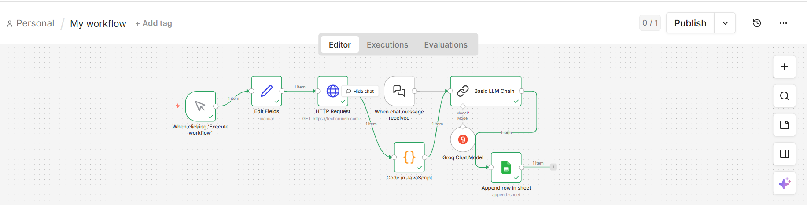

# AI Opportunity Scanner

An agentic workflow built with [n8n](https://n8n.io) that automatically scans tech news, extracts business opportunities using an LLM, and logs structured insights into Google Sheets — no manual research required.

---

## How It Works

The workflow runs in five stages:

1. **Trigger** — Manually execute the workflow with one click
2. **Edit Fields** — Configure the target source and scan parameters
3. **HTTP Request** — Fetches the latest articles from TechCrunch (or any configured source)
4. **Parse + Extract** — A JavaScript node cleans and structures the raw HTML/JSON response
5. **LLM Analysis** — Groq's LLaMA 3.1 (via Basic LLM Chain) reads each article and identifies actionable business opportunities
6. **Log to Sheets** — Structured results are appended to a Google Sheet for review and tracking

---

## Tech Stack

| Component | Tool |
|---|---|
| Workflow Automation | n8n |
| LLM | Groq (LLaMA 3.1) |
| Data Source | TechCrunch RSS / HTTP |
| Output | Google Sheets |
| Logic | JavaScript (n8n Code node) |

---

## Output

Each run appends a new row to Google Sheets with:
- Article title and source URL
- Summary of the opportunity identified
- Relevant business category or domain
- Date of scan

---

## Use Cases

- Staying on top of AI/tech trends for business strategy
- Automating competitive intelligence gathering
- Feeding insights into a weekly opportunity review

---

## License

MIT
